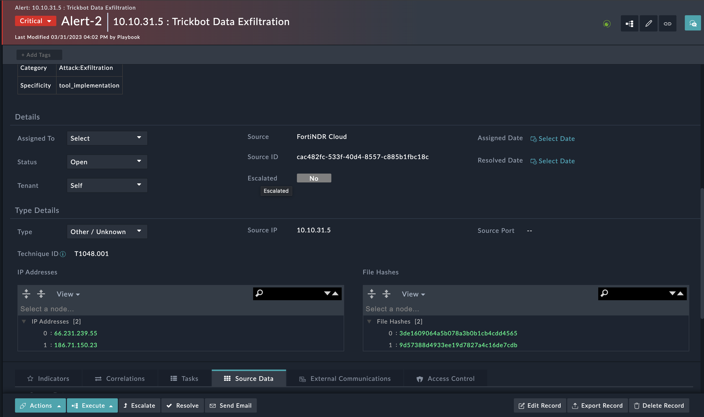

| [Home](../README.md) |
|----------------------|

# Usage

Refer to [Simulate Scenario documentation](https://github.com/fortinet-fortisoar/solution-pack-soc-simulator/blob/develop/docs/usage.md) to understand how to simulate and reset scenarios.

To understand the process FortiSOAR follows to respond to alerts related to data exfiltration detected by FortiNDR Cloud, we have included a scenario &mdash; **FortiNDR Detections** with this solution pack.

## FortiNDR Detections

This scenario generates an example alert related to Data Exfiltration in FortiSOAR's **Alerts** module.

Navigate to the demo alert and note the following:

- The demo alert created is an example of a FortiNDR Cloud detecting a Data Exfiltration on the asset

- The reported alert contains the following information:

    - Specificity 

    - Status

    - Category

    - Confidence

    - Next steps

- Select the alert and manually runs the playbook `Fortinet FortiNDR Cloud > Fetch Detection Events` to perform the following actions:

    - Fetch events for the specified detection and append the same to the source data in the alert.

    - Create a record for an asset on which the data exfiltration issue is detected and link it to the alert.

    - Extracts the indicators and populates fields such as `IP Addresses` and `File Hashes`

    

| [Installation](./docs/setup.md#installation) | [Configuration](./docs/setup.md#configuration) | [Contents](./docs/contents.md) |
|----------------------------------------------|------------------------------------------------|--------------------------------|